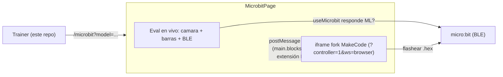

# Integración SmartTEAM: trainer + fork MakeCode + extensión BLE

Documento de mantenibilidad del flujo "Programar micro:bit". Son varios
componentes en repos distintos; acá está el mapa, el contrato entre ellos y los
pasos de deploy.

## Visión general

El recorrido del alumno:

1. Entra al **trainer** (este repo) y entrena un modelo o usa un preset.
2. Toca **"Programar micro:bit"** (aparece en el panel de prueba al haber modelo
   entrenado) → navega a `/microbit?model=<modalidad>`.
3. En `/microbit`: a la izquierda la **evaluación en vivo** (cámara + barras +
   conexión BLE), a la derecha el **fork de MakeCode** embebido, al que el shell
   le inyecta un proyecto con la extensión BLE y los **bloques con las clases
   reales** ya armados.
4. El chico programa, descarga el `.hex` a la micro:bit y **conecta por
   Bluetooth** desde el panel de evaluación para jugar.

## Componentes y repos

| Componente | Repo / ruta | Rol |
| --- | --- | --- |
| Trainer (shell) | este repo | Entrena, evalúa en vivo, embebe el fork e inyecta el proyecto |
| Extensión BLE | `src/core/makecode/extensions/smartteam-ml-bluetooth.ts.txt` (copia de `smartteamok/smartteam-ml-bluetooth`) | Bloques `smartteamMLBT.*`; viaja **inline** dentro del proyecto inyectado |
| Fork MakeCode | `makecode-smartteam` (rama `smartteam-ml`) | Editor propio embebible en modo controller |

## Piezas clave en el trainer

- Página del flujo: `src/app/pages/MicrobitPage.tsx` (+ `.css`), ruteada en
  `src/App.tsx` como `/microbit`.
- Evaluación en vivo (reutilizada): `src/app/hooks/useLiveEvaluation.ts`,
  `src/app/components/trainer/CameraStage`, `LivePredictionBars`,
  `src/app/hooks/useMicrobit.ts`.
- Generación de bloques: `src/core/makecode/codegen.ts`.
- Armado del proyecto pxt: `src/core/makecode/project.ts`.
- Handshake + envío al iframe: `src/core/makecode/controller.ts`.
- Config: `src/core/bridge/config.ts` (`MAKECODE_FORK_URL`).
- Fuente inline de la extensión BLE:
  `src/core/makecode/extensions/smartteam-ml-bluetooth.ts.txt` (importada `?raw`).

## Contrato con el fork (modo controller)

El iframe se carga con `?controller=1&ws=browser`:

- `controller=1` activa el modo controller **sólo dentro de un iframe**
  (`pxt.shell` exige `isIFrame()`), lo que habilita los mensajes del padre
  (`importproject`).
- `ws=browser` fuerza el workspace de IndexedDB. Sin esto, el modo controller
  usa el "iframe workspace", que hace un handshake de storage contra el padre
  (`workspacesync`/`workspacesave`) y **se cuelga en el splash** si el padre no
  implementa ese protocolo. (Por eso NO se usa `allowParentController` global en
  el fork: forzaría el iframe-workspace incluso al abrir el editor solo.)

Protocolo (ver `pxt/pxteditor/editorcontroller.ts` y `app.tsx`):

- Editor → padre, cuando termina de cargar:
  `{ type: "pxthost", action: "editorcontentloaded" }`.
- Padre → editor, para cargar el proyecto:
  `{ type: "pxteditor", id, action: "importproject", project: { text } }`
  donde `text` es un mapa `archivo → contenido`:
  - `pxt.json`: dependencias `core` + `bluetooth` (built-in), `yotta` config que
    abre BLE, y `files: ["main.blocks", "main.ts", "smartteamMLBT.ts", "clases.ts"]`.
  - `main.blocks` / `main.ts`: vacíos. El lienzo arranca limpio; el chico arma
    sus propios bloques desde el toolbox.
  - `smartteamMLBT.ts`: copia inline de la extensión BLE (en vez de una
    dependencia `github:...`, que no resuelve en un build estático sin backend:
    el proxy `/api/gh` devuelve 404). Expone los bloques fijos (clase actual,
    cuando no se detecta, mostrar nombre Bluetooth) y las funciones internas
    `alDetectarClase` / `claseEs` (sin bloque propio).
  - `clases.ts`: generado por `generateClassesFile` (`core/makecode/codegen.ts`)
    a partir de las clases entrenadas. Define `enum ClaseML` (desplegable nativo
    de MakeCode) y los bloques `al detectar clase ML %clase` / `clase ML es
    %clase`, que mapean el enum a las funciones internas de la extensión.

El shell sólo postea `importproject` después de recibir `editorcontentloaded`, y
valida `event.origin` contra el origin del fork.

## Variables de entorno (trainer)

| Var | Default | Para qué |
| --- | --- | --- |
| `VITE_MAKECODE_FORK_URL` | (vacío) | URL del fork deployado que se embebe en `/microbit` |

También se puede pisar la URL del fork por query: `/microbit?mk=<url>`.

## Cambios aplicados al fork

En `makecode-smartteam` (rama `smartteam-ml`):

- `pxt-microbit/pxtarget.json`: **sin** `allowParentController` (se quitó). El
  modo controller se activa por `?controller=1` dentro del iframe; dejar
  `allowParentController` global forzaba el iframe-workspace y colgaba el splash
  al abrir el editor solo.
- `pxt-microbit/targetconfig.json`: `packages.approvedRepoLib` con
  `smartteamok/smartteam-ml-bluetooth` ya no es necesario para este flujo (la
  extensión viaja inline en el proyecto, no como dependencia de GitHub). Se
  puede dejar o quitar.
- (Histórico) parche de permisos del iframe y `approvedEditorExtensionUrls`: no
  son necesarios para este flujo (la cámara corre en el shell, no en el fork).

> Nota: el embed funciona contra el deploy estático **actual** sin rebuildear el
> fork (alcanza con `ws=browser` + extensión inline). Rebuildear/redeployar el
> fork sólo hace falta para que abrir su URL "pelada" (fuera del iframe) tampoco
> se cuelgue.

## El editor MakeCode: fork vs. vanilla (separación)

Hoy **toda la integración vive en el trainer**. El editor sólo necesita features
estándar de MakeCode: `?controller=1` (modo controller dentro de un iframe),
`importproject` y `?ws=browser`. Por eso:

- Los forks `smartteamok/pxt` y `smartteamok/pxt-microbit` (rama `smartteam-ml`)
  ya **no necesitan parches** para este flujo: el commit de `allowParentController`
  se revierte, `approvedRepoLib` no hace falta (extensión inline) y el parche de
  permisos de cámara en `pxt` era del enfoque viejo (editor-extension, descartado).
- El editor embebido podría ser **un staticpkg de MakeCode micro:bit vanilla**
  (build desde upstream, sin tocar el código). Conviene auto-hostearlo igual
  (CSP/`frame-ancestors` del sitio oficial puede bloquear el embed), pero el
  *código* del fork no necesita divergir.

**Recomendación de separación**: tratar el editor como una dependencia externa
referenciada sólo por URL (`VITE_MAKECODE_FORK_URL`). El trainer no asume nada
del fork más allá del protocolo controller estándar. Si tenés otros usos de esos
forks, mantenelos en ramas separadas; este flujo no requiere que diverjan.

## Cómo ajustar (mantenimiento)

| Querés… | Tocá… |
| --- | --- |
| Cambiar/añadir bloques (texto, nuevos handlers) | `src/core/makecode/extensions/smartteam-ml-bluetooth.ts.txt` (fuente inline) y, si cambia un `blockId`, el mapa en `src/core/makecode/codegen.ts` |
| Cambiar el desplegable de clases (enum/bloques generados) | `generateClassesFile` en `src/core/makecode/codegen.ts` |
| Cambiar deps/yotta del proyecto inyectado | `buildMakeCodeProject` en `src/core/makecode/project.ts` |
| Cambiar la URL del editor | env `VITE_MAKECODE_FORK_URL` (o query `?mk=<url>`); resolución en `src/core/makecode/controller.ts` |
| Cambiar flags del iframe (controller/ws/permisos) | `resolveControllerUrl` y el `allow=` del `<iframe>` en `MicrobitPage.tsx` |
| Cambiar el layout (cámara + barras + editor) | `src/app/pages/MicrobitPage.tsx` (+ `.css`) |

> La fuente de la extensión es una **copia** de `smartteamok/smartteam-ml-bluetooth`.
> Si actualizás el repo original, re-sincronizá el `.txt` (y viceversa). El `.txt`
> evita que `tsc`/eslint del trainer lo compilen; se importa con `?raw`.

## Deploy

1. **Extensión BLE**: la fuente vive inline en el trainer
   (`src/core/makecode/extensions/smartteam-ml-bluetooth.ts.txt`). Para evolucionar
   los bloques se edita ese archivo (es copia de `smartteamok/smartteam-ml-bluetooth`).
2. **Fork MakeCode**: el deploy estático actual ya sirve para el embed. Anotar la
   URL y fijarla en `VITE_MAKECODE_FORK_URL` (o pasarla por `?mk=`). Rebuildear
   sólo si se quiere arreglar el caso de abrir el editor fuera del iframe.
3. **Trainer**: build normal; setear `VITE_MAKECODE_FORK_URL` en el entorno.

### Vercel (trainer)

- Project Settings → **Environment Variables**: agregar
  `VITE_MAKECODE_FORK_URL = https://smartteam-makecode-editor.vercel.app/`
  en **Production** (y Preview si querés probar en previews).
- Es una env de **Vite**: se hornea en build, así que hay que **redeployar**
  después de setearla (no alcanza con guardarla).
- El proyecto Vercel del **editor** ya está deployado y no necesita cambios.
- Sin la env, `/microbit` queda sin URL de editor (se puede pasar `?mk=` a mano).

## Pendiente / a verificar en QA

- URL final del fork (hosting propio) → fijar `VITE_MAKECODE_FORK_URL`.
- ✅ `importproject` con `?controller=1&ws=browser` carga el proyecto y los
  bloques aparecen con las clases reales (validado con Puppeteer).
- ✅ La extensión BLE resuelve inline (sin proxy `/api/gh`, sin prompts).
- Opcional: ocultar el simulador propio del fork (appTheme/CSS) para que la
  cámara sea el único "simulador" a la vista.
- E2E de aula: entrenar → Programar → bloques → flashear → conectar BLE → jugar.
