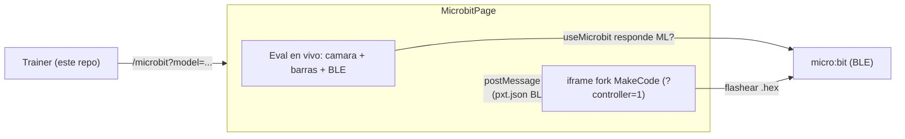

# Integración SmartTEAM: trainer + fork MakeCode + extensión BLE

Documento de mantenibilidad del flujo "Programar micro:bit". Son varios
componentes en repos distintos; acá está el mapa, el contrato entre ellos y los
pasos de deploy.

## Visión general

El recorrido del alumno:

1. Entra al **trainer** (este repo) y entrena un modelo o usa un preset.
2. Toca **"Programar micro:bit"** (aparece en el panel de prueba al haber modelo
   entrenado) → navega a `/microbit?model=<modalidad>`.
3. En `/microbit`: a la izquierda la **evaluación en vivo** (cámara + barras +
   conexión BLE), a la derecha el **fork de MakeCode** embebido, al que el shell
   le inyecta un proyecto con la extensión BLE y los **bloques con las clases
   reales** ya armados.
4. El chico programa, descarga el `.hex` a la micro:bit y **conecta por
   Bluetooth** desde el panel de evaluación para jugar.

## Componentes y repos

| Componente | Repo / ruta | Rol |
| --- | --- | --- |
| Trainer (shell) | este repo | Entrena, evalúa en vivo, embebe el fork e inyecta el proyecto |
| Extensión BLE | `smartteamok/smartteam-ml-bluetooth` | Bloques `smartteamMLBT.*` que reciben las clases por Bluetooth |
| Fork MakeCode | `makecode-smartteam` (rama `smartteam-ml`) | Editor propio embebible en modo controller |

## Piezas clave en el trainer

- Página del flujo: `src/app/pages/MicrobitPage.tsx` (+ `.css`), ruteada en
  `src/App.tsx` como `/microbit`.
- Evaluación en vivo (reutilizada): `src/app/hooks/useLiveEvaluation.ts`,
  `src/app/components/trainer/CameraStage`, `LivePredictionBars`,
  `src/app/hooks/useMicrobit.ts`.
- Generación de bloques: `src/core/makecode/codegen.ts`.
- Armado del proyecto pxt: `src/core/makecode/project.ts`.
- Handshake + envío al iframe: `src/core/makecode/controller.ts`.
- Config: `src/core/bridge/config.ts` (`MAKECODE_FORK_URL`, `MAKECODE_BLE_DEP`).

## Contrato con el fork (modo controller)

El fork acepta mensajes del padre cuando corre con `?controller=1`
(`pxt.shell.isControllerMode()`) o con `allowParentController: true` en el
appTheme. Protocolo (ver `pxt/pxteditor/editorcontroller.ts` y `app.tsx`):

- Editor → padre, cuando termina de cargar:
  `{ type: "pxthost", action: "editorcontentloaded" }`.
- Padre → editor, para cargar el proyecto:
  `{ type: "pxteditor", id, action: "importproject", project: { text } }`
  donde `text` es un mapa `archivo → contenido`:
  - `pxt.json`: dependencias (`core` + `smartteam-ml-bluetooth: github:...`) y
    `files: ["main.blocks", "main.ts"]`.
  - `main.ts`: salida de `generateBlocksCode` (bloques `alDetectarClase("clase")`).
  - `main.blocks`: XML vacío; el editor decompila el `main.ts` al abrir.

El shell sólo postea `importproject` después de recibir `editorcontentloaded`, y
valida `event.origin` contra el origin del fork.

## Variables de entorno (trainer)

| Var | Default | Para qué |
| --- | --- | --- |
| `VITE_MAKECODE_FORK_URL` | (vacío) | URL del fork deployado que se embebe en `/microbit` |
| `VITE_MAKECODE_BLE_DEP` | `github:smartteamok/smartteam-ml-bluetooth` | Dependencia BLE en el `pxt.json` inyectado |

También se puede pisar la URL del fork por query: `/microbit?mk=<url>`.

## Cambios aplicados al fork

En `makecode-smartteam` (rama `smartteam-ml`):

- `pxt-microbit/pxtarget.json`: `appTheme.allowParentController: true`.
- `pxt-microbit/targetconfig.json`: `packages.approvedRepoLib` incluye
  `smartteamok/smartteam-ml-bluetooth` para que la dependencia importe sin pedir
  aprobación manual.
- (Histórico) parche de permisos del iframe y `approvedEditorExtensionUrls`: no
  son necesarios para este flujo (la cámara corre en el shell, no en el fork).

## Deploy

1. **Extensión BLE**: ya publicada como repo MakeCode (`smartteam-ml-bluetooth`,
   namespace `smartteamMLBT`). Si cambia, subir nueva versión/tag.
2. **Fork MakeCode**: buildear y deployar a hosting propio. Anotar la URL final
   y fijarla en `VITE_MAKECODE_FORK_URL` (o pasarla por `?mk=`).
3. **Trainer**: build normal; setear `VITE_MAKECODE_FORK_URL` en el entorno.

## Pendiente / a verificar en QA

- URL final del fork (hosting propio) → fijar `VITE_MAKECODE_FORK_URL`.
- Confirmar que `importproject` con `?controller=1` carga el proyecto y los
  bloques aparecen decompilados con las clases reales.
- Confirmar que la dependencia BLE resuelve sin prompt (approvedRepoLib).
- Opcional: ocultar el simulador propio del fork (appTheme/CSS) para que la
  cámara sea el único "simulador" a la vista.
- E2E de aula: entrenar → Programar → bloques → flashear → conectar BLE → jugar.
